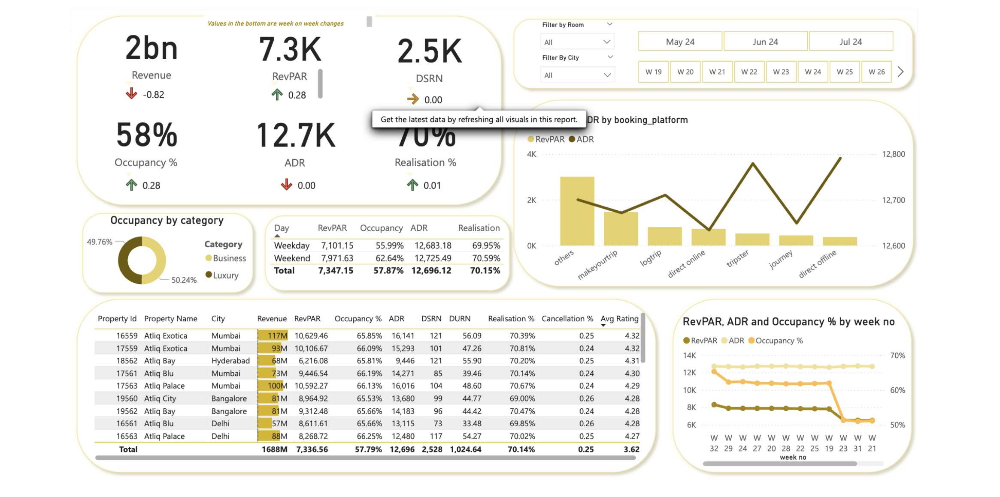

# Hospitality Dashboard Project using Power BI

This project involves creating an end-to-end dashboard for Atliq Grand, a multiple five-star hotel, to help them address a loss in market share by making data-informed decisions.

## Table of Contents
- [Project Overview](#project-overview)
- [Objective](#objective)
- [Solution](#solution)
- [Technologies Used](#technologies-used)
- [Installation](#installation)
- [Usage](#usage)
- [Preview](#preview)

## Project Overview

Atliq Grand, a prestigious five-star hotel chain, noticed a decline in its market share and sought a solution to address this issue. This project focuses on developing a comprehensive dashboard to analyze various aspects of their business, enabling data-driven decisions to regain and improve market share.

## Objective

The primary objective of this project is to provide Atliq Grand with an end-to-end dashboard that tracks key performance indicators (KPIs), revenue by category, trends, property performance, realization percentages, and other crucial metrics.

## Solution

#### Situation

Atliq Grand experienced a loss in market share and needed a method to address and understand this decline.

#### Task

Develop a dashboard using Power BI to aid Atliq Grand in making informed business decisions by providing insightful data analysis.

#### Action
- Analyzed data using Power BI to track revenue by category.
- Monitored trends by key metrics.
- Evaluated property performance.
- Calculated realization percentages and other KPIs.

#### Result

The dashboard provided comprehensive insights, enabling Atliq Grand to take actionable steps to increase their market share.

## Technologies Used
- Power BI: For creating and managing the dashboard.
- Data Analysis: Techniques and methods used to process and analyze the data.
- KPIs: Identification and tracking of key performance indicators.

## Installation
1.	Clone the Repository:
 
```
git clone https://github.com/yourusername/atliq-grand-dashboard.git
cd atliq-grand-dashboard
```

2.	Install Dependencies:
Ensure you have Power BI installed on your system.

## Usage
1.	Open Power BI:
      - Launch Power BI on your system.
3.	Load the Data:
      -  Import the data files into Power BI as per the instructions provided in the repository.
3.	Navigate the Dashboard:
      -  Explore the various visualizations and insights provided by the dashboard to understand the performance and key metrics of Atliq Grand.


## Preview


